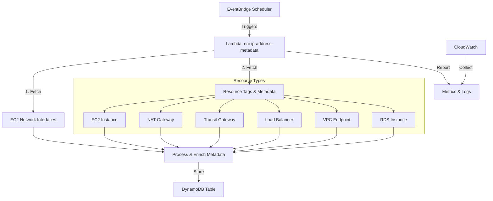
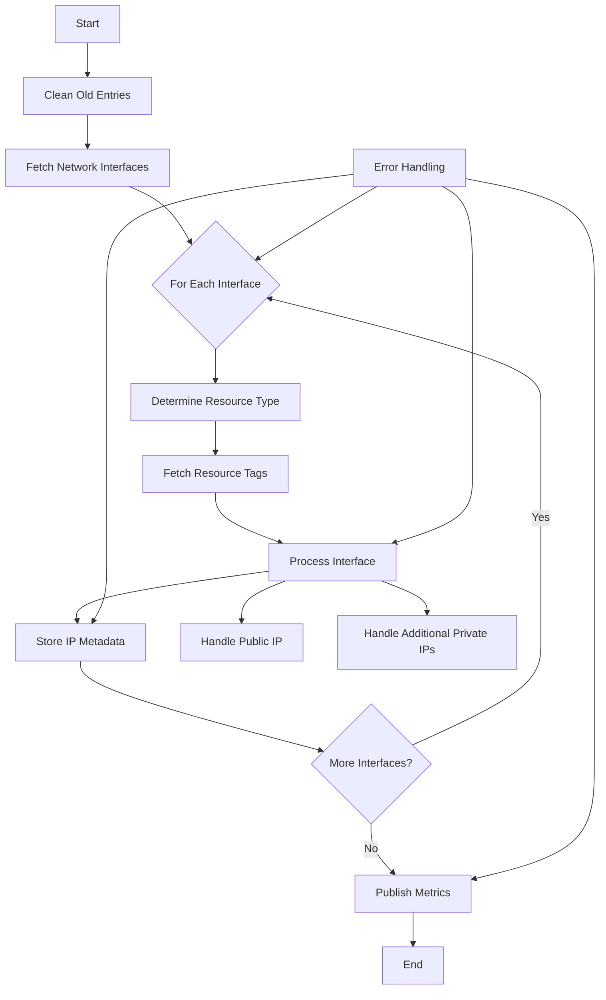

# IP Address Metadata Enrichment Lambda Function

This Lambda function enriches IP address metadata by processing network interfaces and storing the information in a DynamoDB table. It handles various AWS resources including EC2 instances, NAT Gateways, Transit Gateways, Load Balancers, VPC Endpoints, and RDS instances.

## Features

- Processes all network interfaces in the AWS account
- Enriches metadata with resource tags, owner information, and status
- Handles public and private IP addresses
- Cleans old entries using TTL
- Publishes metrics to CloudWatch

## Prerequisites

- AWS Lambda environment
- Proper IAM permissions for EC2, ELB, RDS, DynamoDB, and CloudWatch
- DynamoDB table for storing metadata

## Environment Variables

- `DYNAMODB_TABLE_NAME`: Name of the DynamoDB table to store metadata

## Main Components

1. `lambda_handler`: Main entry point for the Lambda

